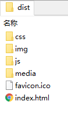

### 使用less

如果想在 Vue 中使用 less，我们需要以下步骤：

1. 在 style 标签上添加 `lang="less"` 属性。
2. 下载 lessLoader，从而让 webpack 能够处理 less 文件。
   * 下载为开发时依赖（--dev）
   * 注意版本兼容问题

*详解：*

先在 style 标签上添加 `lang="less"` 属性。

```
<style lang="less" scoped>
	……
</style>
```

但此时不能直接编写 less ，因为 webpack 默认情况下不能处理 less，会出现报错。

我们可以下载 lessLoader，从而让 webpack 能够处理 less 文件。

但你要注意两个问题：

* 下载为开发时依赖（--dev）

  只在开发时依赖 lessLoader ，项目真正打包后，会将 less 文件转化为 css。

* 注意版本兼容问题

  下载最新版本，会导致与项目产生冲突

因此，可以下载较低的稳定版本。

```
yarn add less-loader@6.0.0 --dev
```

### 引入图片

有时，我们需要引入项目本地的图片资源。但在此过程中可能会产生一系列的问题，这些问题在之前开发 react 项目时，也遇到过。

在 vuecli 项目中，正确引入图片资源，有下面两种方法：

1. 直接通过路径引入
2. 通过 require 引入

#### 直接通过路径引入

1.直接通过相对路径引入

```

```

当然，如果嵌套层级很深，这些 `../../` 前缀，看起来很难受。我们可以添加一些特殊前缀，让 webpack 识别。

2.特殊前缀（`@/`、`~`）

* `@/`、`~` 它们会自动索引到 `src` 目录下

```

```

```

```

它们最终都会被转化为 base64 码引入。

```

```

#### require 引入

require 方式引入，是比较好的方案，之前在开发 react 项目时，也使用了该方式。

有时候我们会引入大量的图片资源，此时就要将这些路径抽离为独立的数据，最后以变量的形式在组件中引入。

你可能会写出以下代码：

* 直接将上文中的 [直接通过路径引入](####直接通过路径引入) 抽离为数据
* 但很遗憾，这种形式不能够作为变量成功引入

```
sideBarItemsInfo: [
  {
    path: "/workCollection",
    imageSrc: "~assets/images/icons/sidebar/workCollection.png",
    //imageSrc: "@/assets/images/icons/sidebar/workCollection.png",
    desc: "作品集",
  },
  ……
],
```

我们需要使用 require

* require 中的路径，**只支持** `@/` **前缀**，会自动索引到 `src` 目录下。

```
sideBarItemsInfo: [
  {
    path: "/workCollection",
    imageSrc: require("@/assets/images/icons/sidebar/workCollection.png"),
    desc: "作品集",
  },
  {
    path: "/profile",
    imageSrc: require("@/assets/images/icons/sidebar/profile.png"),
    desc: "关于我",
  },
  ……
],
```

require 中必须是具体的路径 string ，不能包含变量。

* 你可能想把图片路径的 公共前缀 抽离为变量
* 但很遗憾，require 中不能包含变量

以下代码，图片不能成功引入

```
const preImgSrc = "@/assets/images/icons/sidebar";
……
sideBarItemsInfo: [
  {
    path: "/workCollection",
    imageSrc: require(`${preImgSrc}/workCollection.png`),
    desc: "作品集",
  },
  {
    path: "/profile",
    imageSrc: require(`${preImgSrc}/profile.png`),
    desc: "关于我",
  },
  ……
],
```

### 打包发布

主要涉及到两个问题：

1. 资源路径
2. 路由异常

#### 资源路径

在打包前，如果不做任何处理，则 css、js 等其它所有资源的引入都会出错。

因为在打包后，会生成一个 `index.html` 也就是 SPA 的入口文件，也是唯一的页面，所有的资源都在该页面中引入、加载。



因此，打包后的引入路径，应改为相对于 `index.html` 文件的路径。

在 vue.config.js 中配置 publicPath 选项

* 若为生产环境，则公共资源路径为 `./`

```
module.exports = {
  publicPath: process.env.NODE_ENV === "production" ? "./" : "/",
	……
};
```

#### 路由异常

通常在开发时，我们喜欢将 vue-router 设置为 H5 的 history 模式，但该方式在上线后，需要后端的一些配合，才能正常使用。

因此，在发布前，如果没有给后端相应配置，应改为 hash 模式。

```
const router = createRouter({
  history: createWebHashHistory(),
  routes,
});
```

